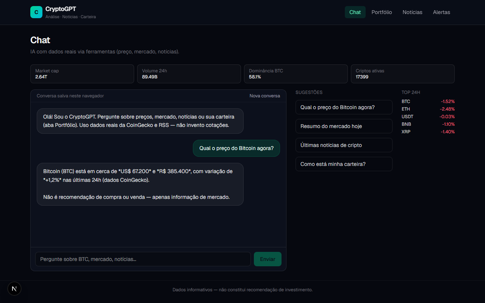
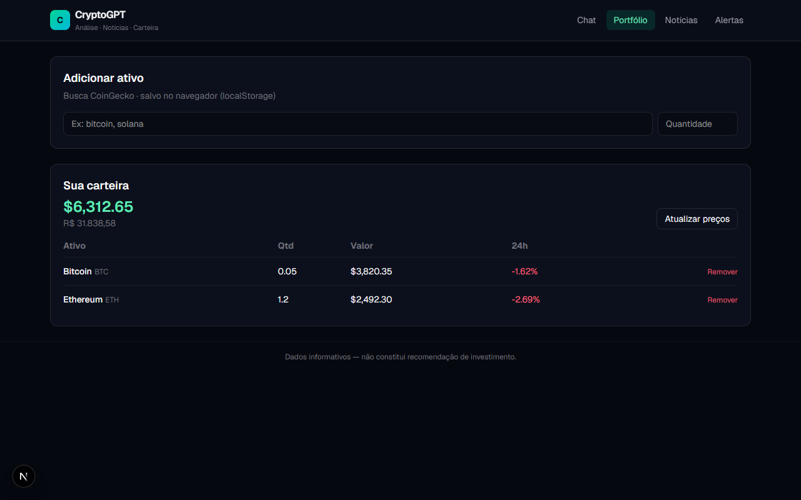
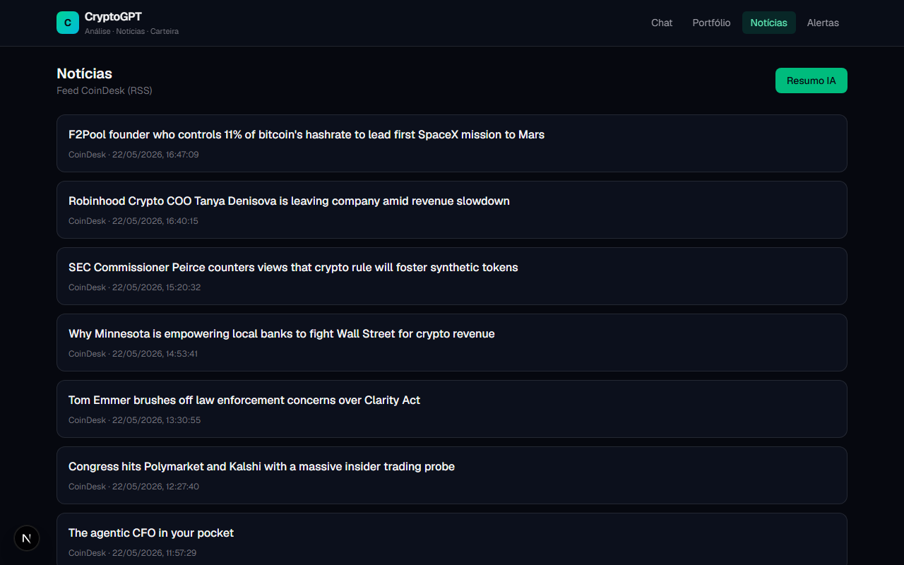
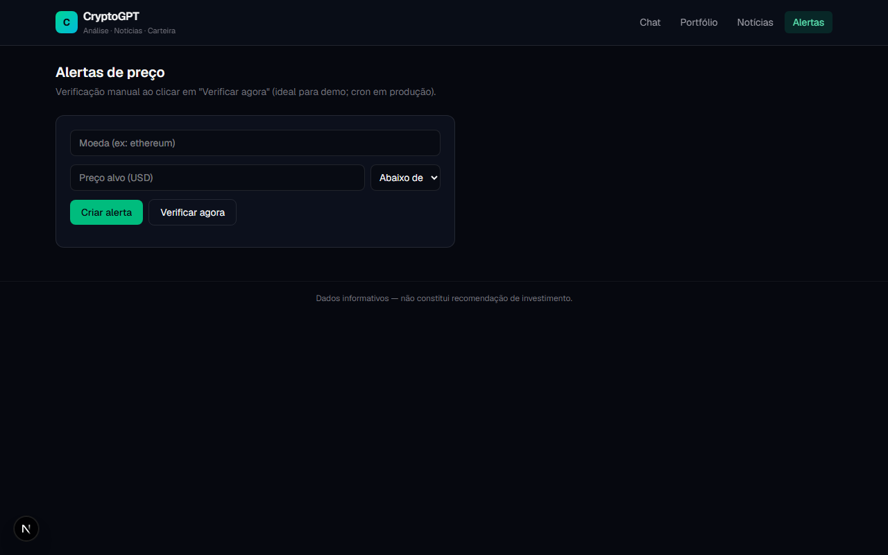

# CryptoGPT

Assistente de criptomoedas com **IA (Groq)**, **dados reais** (CoinGecko), **notícias** (RSS CoinDesk), **portfólio** e **alertas de preço** — projeto de portfólio com código modular e fácil manutenção.

## Demonstração

Interface web (Next.js). O chat usa **function calling** para buscar preço e mercado antes de responder. As imagens abaixo mostram as principais telas.

| Chat com IA e dados reais | Portfólio (USD/BRL, 24h) |
|:---:|:---:|
|  |  |

| Notícias (RSS + resumo IA) | Alertas de preço |
|:---:|:---:|
|  |  |

> **CryptoGPT** — Groq + CoinGecko + RSS; histórico de chat no navegador; portfólio e alertas em `localStorage` (demo sem login).

## Outros projetos

| Projeto | Repositório | Demo |
|---------|-------------|------|
| **CryptoGPT** (este) | [github.com/rafaelcostr/crypto-gpt](https://github.com/rafaelcostr/crypto-gpt) | Capturas de tela acima |
| [whatsapp-atendimento-bot](https://github.com/rafaelcostr/whatsapp-atendimento-bot) | Bot WhatsApp + Groq | Capturas no repositório |
| [Crypto-Dashboard](https://github.com/rafaelcostr/Crypto-Dashboard) | Dashboard visual | [Vercel](https://crypto-dashboard-iota-peach.vercel.app) |

## Funcionalidades

- **Chat:** perguntas sobre preços, mercado e notícias; a IA chama ferramentas antes de responder (sem inventar cotações). Histórico salvo no navegador (`localStorage`, até 50 mensagens).
- **Portfólio:** adicionar ativos, valor em USD/BRL, variação 24h (salvo no navegador).
- **Notícias:** feed RSS + botão **Resumo com IA**.
- **Alertas:** preço alvo acima/abaixo; verificação manual (demo).

## Stack

- Next.js 16, React 19, TypeScript, Tailwind CSS 4
- [Groq API](https://console.groq.com/) — chat e resumos
- [CoinGecko API](https://www.coingecko.com/en/api) — mercado (sem chave no tier gratuito)
- CoinDesk RSS — manchetes

## Arquitetura

```
src/
├── app/api/           # Route handlers (BFF)
├── components/        # UI por funcionalidade
├── config/            # Variáveis de ambiente (Zod)
├── lib/ai/            # Agent + tools + prompts
├── lib/integrations/  # CoinGecko, notícias
└── types/
```

Detalhes: [docs/ARCHITECTURE.md](docs/ARCHITECTURE.md)

## Instalação

```bash
git clone https://github.com/rafaelcostr/crypto-gpt.git
cd crypto-gpt
npm install
cp .env.example .env.local
# Edite .env.local e defina GROQ_API_KEY
npm run dev
```

Abra [http://localhost:3000](http://localhost:3000).

## Variáveis de ambiente

| Variável | Obrigatória | Descrição |
|----------|-------------|-----------|
| `GROQ_API_KEY` | Sim (chat/resumo) | Chave em [console.groq.com](https://console.groq.com/keys) |
| `GROQ_MODEL` | Não | Padrão: `llama-3.3-70b-versatile` |
| `COINGECKO_BASE_URL` | Não | Padrão: API v3 pública |

## Scripts

| Comando | Ação |
|---------|------|
| `npm run dev` | Desenvolvimento |
| `npm run build` | Build de produção |
| `npm start` | Servidor após build |
| `npm run lint` | ESLint |
| `npm run typecheck` | Verificação TypeScript |
| `npm run screenshots` | Gera capturas de tela em `docs/images/` (app rodando) |

## Deploy (Vercel)

1. Importe o repositório na Vercel.
2. Adicione `GROQ_API_KEY` em **Environment Variables**.
3. Deploy.

## Roadmap

- [ ] Análise de gráfico (upload + visão)
- [ ] Alertas com cron + e-mail/Telegram
- [ ] Auth + portfólio em banco (Supabase)

## Aviso legal

Informações educacionais. **Não constitui recomendação de investimento.** Operações em criptoativos envolvem risco.

## Licença

MIT
